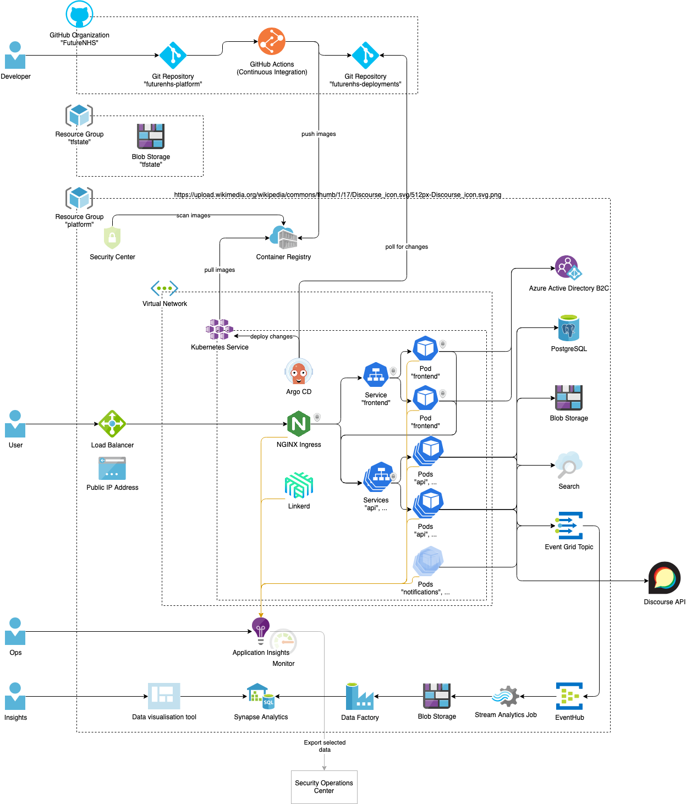

# Architecture

## High level diagram

This represents the current plan. Some parts are not implemented, yet (transparent in the picture) and may be subject to change.

- Developers interact with two Git repositories "futurenhs-platform" and "futurenhs-deployments"
- Continuous integration builds Docker images and pushes them to a Container Registry
- Resources are hosted in Azure and are split into the resource groups "tfstate" and "platform"
- Applications are deployed to a Kubernetes cluster, which sits inside a private Virtual Network
- Argo CD deploys applications to the cluster based on changes in the "futurenhs-deployments" repository
- Traffic inside the cluster uses mutual TLS provided by Linkerd
- A public load balancer connects to an NGINX ingress controller in the cluster and is the only entry point to the cluster
- Authentication is handled by ORY Kratos and enforced by NGINX through it's "external authentication" feature
- All applications send metrics and traces to Application Insights (TODO)
- Applications access CosmosDB, Blob Storage, Search and EventHub (TODO)
- Analytics data is sent through Data Factory to Synapse Analytics (TODO)

## Change process and approvals

See [Governance documentation](../governance.md).
